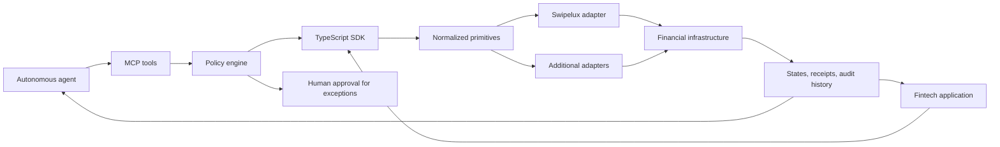

# Agent-Native Financial Primitives README Implementation Plan

> **For agentic workers:** REQUIRED SUB-SKILL: Use superpowers:subagent-driven-development (recommended) or superpowers:executing-plans to implement this plan task-by-task. Steps use checkbox (`- [ ]`) syntax for tracking.

**Goal:** Replace the starter README with a cinematic, screenshot-led product page that markets provider-neutral financial primitives for autonomous agents and defines the MCP/TypeScript SDK contract for subsequent implementation.

**Architecture:** Keep the working React demo unchanged. Capture deterministic demo states as documentary evidence, compose those captures into a GitHub-friendly hero image, and make the README the product contract for an MCP server backed by a TypeScript SDK and policy engine. Separate present capabilities from the next implementation layer in an explicit status matrix.

**Tech Stack:** GitHub Flavored Markdown, Mermaid, HTML image tables, PNG demo captures, Vite/React demo, browser automation, existing npm quality commands.

---

## File Map

- Create `docs/assets/readme/business-dashboard.png` — working business-persona dashboard.
- Create `docs/assets/readme/identity-onboarding.png` — individual onboarding/provisioning flow.
- Create `docs/assets/readme/transaction-quote.png` — quoted bank payout and workflow explanation.
- Create `docs/assets/readme/deposit-rails.png` — bank and USDC funding views composed from real captures.
- Create `docs/assets/readme/neobank-primitives-hero.png` — 1600 x 900 cinematic cover built from real demo captures.
- Create `docs/assets/readme/hero-source.html` — reproducible HTML composition source for the hero PNG.
- Create `docs/assets/readme/deposit-rails-source.html` — reproducible two-panel composition source for the deposit PNG.
- Replace `README.md` — agent-native positioning, screenshots, architecture, contract, quickstart, status, and provider information.
- Preserve `docs/specs/2026-07-13-agent-native-readme-design.md` — approved design and truth boundary.

## Baseline Constraint

The untouched repository fails `npm run typecheck` on macOS because
`AppContext.tsx`/`appContext.ts` and
`ExplainerContext.tsx`/`explainerContext.ts` differ only by case. This plan does
not modify those unrelated files. Each verification checkpoint records the
failure and continues with checks that can run independently.

### Task 1: Capture The Working Demo States

**Files:**
- Create: `docs/assets/readme/business-dashboard.png`
- Create: `docs/assets/readme/identity-onboarding.png`
- Create: `docs/assets/readme/transaction-quote.png`
- Temporary local captures: bank and USDC funding views used by Task 2

- [ ] **Step 1: Create the asset directory and confirm the branch is clean apart from committed plan/spec work**

Run:

```bash
mkdir -p docs/assets/readme
git status --short --branch
```

Expected: branch `codex/market-readme`; no tracked implementation changes yet.

- [ ] **Step 2: Open the deployed demo in an isolated browser session**

Navigate to:

```text
https://neobank-starter.vercel.app
```

Use a 430 x 932 viewport. Confirm the visible application is in Demo mode and
contains no API key or personal information. Reset demo state before capture.

- [ ] **Step 3: Capture the business dashboard**

Actions:

1. Open the customer switcher.
2. Select `Northwind Ltd`.
3. Return to the Home route.
4. Wait until balances and activity are rendered.
5. Capture the application viewport without browser chrome.

Save as:

```text
docs/assets/readme/business-dashboard.png
```

The image must visibly contain the Demo label, EUR and USDC balances, virtual
account details, and recent business transfer activity.

- [ ] **Step 4: Capture individual onboarding**

Actions:

1. Reset demo state in a fresh browser context.
2. Navigate to `/onboarding`.
3. Enter `Taylor`, `Morgan`, and `taylor@example.com`.
4. Start account creation.
5. Capture the provisioning timeline while customer, verification, wallet, and
   account steps are visible; if the transition completes before capture, use
   the final `Account ready` state that names those four resources.

Save as:

```text
docs/assets/readme/identity-onboarding.png
```

- [ ] **Step 5: Capture a payout quote**

Actions:

1. Reset demo state in a fresh browser context.
2. Use the default funded individual persona.
3. Navigate to `/send` and keep the Bank tab active.
4. Enter `250` in the amount field.
5. Request a quote; retain the auto-selected demo recipient.
6. Keep the workflow explainer visible if it opens automatically.
7. Capture after fee, rate, destination amount, and action button render.

Save as:

```text
docs/assets/readme/transaction-quote.png
```

- [ ] **Step 6: Capture both deposit rails for later composition**

Actions:

1. Navigate to `/add-money` with the funded individual persona.
2. Capture the bank/SEPA instructions view.
3. Switch to the crypto/USDC tab.
4. Capture the Polygon wallet-address view.

Keep both captures local for Task 2; they will be combined into
`deposit-rails.png` so the documentary image shows both real states without
inventing UI.

- [ ] **Step 7: Verify the raw captures**

Run:

```bash
test -s docs/assets/readme/business-dashboard.png
test -s docs/assets/readme/identity-onboarding.png
test -s docs/assets/readme/transaction-quote.png
file docs/assets/readme/*.png
sips -g pixelWidth -g pixelHeight docs/assets/readme/business-dashboard.png
sips -g pixelWidth -g pixelHeight docs/assets/readme/identity-onboarding.png
sips -g pixelWidth -g pixelHeight docs/assets/readme/transaction-quote.png
```

Expected: each committed raw capture is a non-empty PNG and uses one consistent
430 x 932 capture viewport or an equivalent consistent crop.

### Task 2: Compose The Deposit And Hero Artwork

**Files:**
- Create: `docs/assets/readme/deposit-rails-source.html`
- Create: `docs/assets/readme/deposit-rails.png`
- Create: `docs/assets/readme/hero-source.html`
- Create: `docs/assets/readme/neobank-primitives-hero.png`

- [ ] **Step 1: Build the deposit composition source**

Create `deposit-rails-source.html` as a fixed 1200 x 760 canvas with:

- A dark navy editorial background.
- Heading `Fund across bank and crypto rails`.
- Subheading `Virtual-account instructions and stablecoin deposit addresses.`
- The real bank capture in the left panel.
- The real USDC capture in the right panel.
- Small labels `BANK RAILS` and `STABLECOIN RAILS`.
- No claim that SWIFT is an interactive flow.

Use only local image paths and system fonts. Do not embed credentials or external
tracking resources.

- [ ] **Step 2: Render the deposit composition**

Serve the asset directory locally, open the source at exactly 1200 x 760, and
capture the document body without browser chrome.

Save as:

```text
docs/assets/readme/deposit-rails.png
```

- [ ] **Step 3: Build the hero composition source**

Create `hero-source.html` as a fixed 1600 x 900 canvas with:

- Dark navy-to-black radial background.
- Eyebrow `MCP + TYPESCRIPT SDK`.
- Heading `Financial primitives for autonomous agents`.
- Primitive line `Identity · Value storage · Transactions · Policy · Observability`.
- Business dashboard centered and largest.
- Transaction quote tilted slightly left.
- Identity onboarding tilted slightly right.
- Restrained blue glow, thin device borders, and strong text contrast.
- Visible Demo state inside each real screenshot.
- No fictional policy controls inside the captured application frames.

- [ ] **Step 4: Render the hero composition**

Serve the asset directory locally, open the source at exactly 1600 x 900, and
capture the document body without browser chrome.

Save as:

```text
docs/assets/readme/neobank-primitives-hero.png
```

- [ ] **Step 5: Verify all final assets**

Run:

```bash
test -s docs/assets/readme/deposit-rails.png
test -s docs/assets/readme/neobank-primitives-hero.png
file docs/assets/readme/*.png
sips -g pixelWidth -g pixelHeight docs/assets/readme/deposit-rails.png
sips -g pixelWidth -g pixelHeight docs/assets/readme/neobank-primitives-hero.png
```

Expected: deposit artwork is 1200 x 760; hero artwork is 1600 x 900; all files
are valid PNGs.

- [ ] **Step 6: Review for sensitive or misleading content**

Inspect every final PNG at original resolution. Confirm:

- No API key, credential, local path, browser chrome, or real personal data.
- Demo/sandbox context remains visible.
- Policy and KYB UI are not fabricated.
- Text remains legible at GitHub content width.

- [ ] **Step 7: Commit the image assets**

Run:

```bash
git add docs/assets/readme
git diff --cached --check
git commit -m "docs: add financial primitives demo artwork"
```

Expected: one asset-only commit.

### Task 3: Replace The README With The Product Page

**Files:**
- Modify: `README.md`
- Reference: `docs/specs/2026-07-13-agent-native-readme-design.md`

- [ ] **Step 1: Replace the starter hero**

Use centered HTML for the project name, tagline, concise description, and
badges. The first Markdown image is:

```markdown

```

The hero copy must say:

```text
Financial primitives for autonomous agents.

A provider-neutral MCP server and TypeScript SDK for identity, KYC/KYB,
wallets, virtual accounts, deposits, payouts, stablecoin transfers, and
policy-controlled execution. Clone the runnable reference app, explore
realistic financial flows, and connect your preferred infrastructure provider.
```

Add primary links for `Clone and build` and `View the demo`.

- [ ] **Step 2: Add the primitive surface**

Create a five-column GitHub-compatible HTML table for:

```text
Identity | Value storage | Transactions | Policy | Observability
KYC/KYB  | Wallets       | Quotes       | Budgets| States
People   | Balances      | Payouts      | Limits | Receipts
Business | Accounts      | Transfers    | Approval | Audit
```

Follow with one sentence explaining that the React demo is the reference
application across these boundaries.

- [ ] **Step 3: Add the screenshot-led `See it working` section**

Use a two-column HTML table with the four final images and these captions:

```text
Hold and observe value — Fiat, stablecoins, account details, and transfer history.
Provision a financial identity — Customer, individual KYC, wallet, and virtual-account primitives.
Quote, authorize, and transfer — Rates, fees, recipients, workflow context, and execution state.
Fund across bank and crypto rails — Virtual-account and stablecoin deposit instructions.
```

- [ ] **Step 4: Add the agent-native architecture**

Use this Mermaid graph:



Explain the lifecycle in one line:

```text
Validate → authorize → execute → normalize → audit.
```

- [ ] **Step 5: Add the MCP and TypeScript SDK implementation contract**

Label the section `Target MCP + SDK contract` until the packages exist. Include
this representative MCP call:

```json
{
  "tool": "transactions.transfer.create",
  "arguments": {
    "from": "wallet_main",
    "amount": "250.00",
    "asset": "EUR",
    "recipient": "recipient_maria",
    "rail": "sepa"
  }
}
```

Show a policy result that communicates `approved`, the matched budget, and a
receipt identifier. List the intended tool families without claiming the
current repository already exports an MCP server.

- [ ] **Step 6: Add quickstart and demo/live behavior**

Use the personal repository URL:

```bash
git clone https://github.com/andry-lebedev/neobank-primitives.git
cd neobank-primitives
npm install
npm run dev
```

State that demo mode needs no credentials. Describe Swipelux as the first live
sandbox adapter. Do not mention `VITE_API_TOKEN`; current credential entry is
in-app only.

- [ ] **Step 7: Add the implementation status matrix**

Create three columns: `Working reference app`, `Next implementation`, and
`Integration responsibility`.

Working includes the demo, customer/KYC flow, wallets, balances, virtual
accounts, quotes, transfers, activity, and Swipelux adapter. Next includes MCP,
packaged SDK, policy engine, full KYB, audit receipts, and more adapters.
Integration responsibility includes authentication, approval operations,
secure credentials, webhooks, idempotency, reconciliation, and production
controls.

- [ ] **Step 8: Add provider and customization sections**

Explain that Swipelux is the first provider adapter. Retain concise links to its
API documentation. Add a shortened AI coding-agent prompt that uses the correct
clone URL and keeps changes on a new branch.

- [ ] **Step 9: Add quality commands and safety note**

List:

```bash
npm run typecheck
npm test
npm run lint
npm run build
```

End with a concise notice that the repository is a sandbox reference app and
product contract, not a production banking backend.

- [ ] **Step 10: Check README copy and links**

Run:

```bash
git diff --check
rg -n 'swipelux/neobank-starter|VITE_API_TOKEN|production-ready|fully autonomous today' README.md
rg -n 'andry-lebedev/neobank-primitives|Financial primitives for autonomous agents|Target MCP' README.md
```

Expected: the first search returns no stale or misleading copy; the second
returns the new repository URL, tagline, and labeled target interface.

- [ ] **Step 11: Commit the README**

Run:

```bash
git add README.md
git diff --cached --check
git commit -m "docs: market agent-native financial primitives"
```

Expected: one README-only commit.

### Task 4: Verify The Complete GitHub Story

**Files:**
- Verify: `README.md`
- Verify: `docs/assets/readme/*`

- [ ] **Step 1: Verify repository state and intended diff**

Run:

```bash
git status --short --branch
git diff origin/master...HEAD --stat
git diff origin/master...HEAD -- README.md docs/assets/readme docs/specs docs/plans
```

Expected: only the spec, plan, README, and README assets differ from
`origin/master`.

- [ ] **Step 2: Verify Markdown and asset references**

Run a local link/image check over `README.md` and confirm each referenced local
asset exists and is non-empty. Render the README in a GitHub-compatible preview
and inspect the hero, primitive table, screenshot grid, Mermaid diagram, code
blocks, status table, and narrow-width behavior.

- [ ] **Step 3: Run the independently executable checks**

Run:

```bash
npm test
npm run lint
npm run build
```

Record exact results. Run `npm run typecheck` once and record the known
case-collision failure without attributing it to the README change.

- [ ] **Step 4: Perform a final factual review**

Check every claim against the approved status boundary:

- Autonomous execution is the designed MCP/SDK contract, not hidden existing code.
- Complete KYB is not presented as implemented.
- SWIFT is not presented as a complete interactive payout flow.
- Swipelux is the first adapter, not the repository identity.
- No production, regulatory, custody, or settlement guarantee is asserted.

- [ ] **Step 5: Push and publish the completed branch**

Fetch first and confirm `origin/master` is still the implementation base. Push
`codex/market-readme`, then fast-forward `master` from the verified branch so
the new README becomes the repository landing page. Do not force-push.

Run:

```bash
git fetch origin --prune
git merge-base --is-ancestor origin/master HEAD
git push -u origin codex/market-readme
git push origin codex/market-readme:master
```

Expected: both pushes succeed as fast-forwards.

- [ ] **Step 6: Verify the live repository**

Confirm on GitHub that:

- `master` points to the verified implementation commit.
- The README hero and all four screenshots render.
- The Mermaid diagram renders.
- The repository is still public, independent, and owned by `andry-lebedev`.
- The live README contains the new clone URL and implementation-status boundary.
